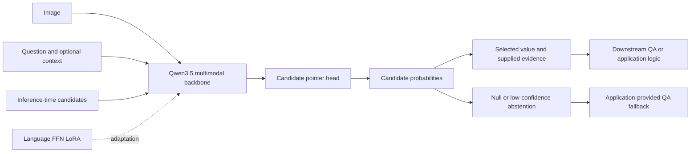

<div align="center">

# Vision-JEV
### Efficient Multimodal Question Answering through Structured Extraction and Decisions

[](https://github.com/arnodjiang/Vision-JEV/actions/workflows/tests.yml)
[](LICENSE)
[](pyproject.toml)

**A Qwen3.5-0.8B research framework for candidate-based multimodal information extraction and non-autoregressive decisions.**

[Method](docs/METHOD.md) · [Data format](docs/DATA_FORMAT.md) · [Experiments](docs/EXPERIMENTS.md) · [Validation](docs/VALIDATION.md) · [Contributing](CONTRIBUTING.md)

</div>

## Overview

Many visual QA questions require selecting a field, identifying a category, or deciding whether a condition holds. Vision-JEV studies an alternative to generating an answer token by token: preserve a pretrained vision-language backbone, adapt it with LoRA, and read out a probability distribution over structured candidates.

Given an image, a question, optional context, and inference-time candidates, the model returns a selected value, candidate-provided evidence, and a distribution for downstream QA. Independent questions can run as separate rows in one batch. Structured outputs can support application-defined calculations or a generative QA fallback.

**Research status — v0.1 prototype.** The title describes the research objective. End-to-end efficiency and QA improvements have **not** been established. The implementation has been tested with official Qwen3.5-0.8B weights, including a one-step synthetic-image LoRA update, checkpoint recovery, batch inference, and adapter merging. No task-ready checkpoint or manuscript has been released. See the [validation record](docs/VALIDATION.md).

## Method at a glance



The implemented model ends at the structured prediction. Candidate generation, calculations, and fallback QA are application components; the library does not silently supply them.

| Task | Output | Typical use |
| --- | --- | --- |
| `extract` | A candidate value and its evidence metadata | OCR span or table-cell selection |
| `choice` | One candidate category | Entity, relation, or answer-class selection |
| `boolean` | A Boolean candidate value | Yes/no judgments |

All three tasks share a trainable pointer head. Evidence boxes are supplied by candidates, not predicted by a localization head. Extraction is limited by candidate coverage; it is not arbitrary image-to-string recognition.

## Quick start

Use Python 3.11 or newer. CPU is sufficient for the small architecture tests. Actual model runs download the backbone and require additional memory; use CUDA for larger training experiments.

```bash
git clone https://github.com/arnodjiang/Vision-JEV.git
cd Vision-JEV
python3 -m venv .venv
source .venv/bin/activate
python -m pip install -e '.[dev]'
pytest -q
vision-jev --help
```

Default tests use randomly initialized, tiny instances of the real Qwen3.5 architecture. Three optional tests use a downloaded official processor; see [reproduction instructions](docs/EXPERIMENTS.md). `requirements-tested.txt` records the original macOS smoke-test environment, not a universal CUDA lockfile.

### Train on an independent visual fixture

```bash
python examples/make_visual_demo.py
vision-jev train \
  --data outputs/visual-demo/train.jsonl \
  --eval-data outputs/visual-demo/eval.jsonl \
  --base Qwen/Qwen3.5-0.8B \
  --revision 2fc06364715b967f1860aea9cf38778875588b17 \
  --mode lora --shuffle-candidates \
  --output checkpoints/demo --device cpu
```

This creates one training image and one held-out image to exercise the workflow. **It is not enough data to train a useful model.** Replace these files with independently annotated KIE data for actual research. All translations and renderings of the same source document must share `group_id`.

### Predict, evaluate, and merge

```bash
vision-jev predict --checkpoint checkpoints/demo \
  --data outputs/visual-demo/eval.jsonl --output outputs/predictions.jsonl
vision-jev evaluate --data outputs/visual-demo/eval.jsonl \
  --predictions outputs/predictions.jsonl
vision-jev merge --checkpoint checkpoints/demo --output checkpoints/demo-merged
```

Checkpoints include the pointer head and processor. Adapter checkpoints refer to a pinned base model; merged checkpoints include the backbone. Both use the Vision-JEV interface, rather than a generic chat endpoint. Existing output paths are not overwritten by the CLI.

### Python API

```python
from vision_jev.pipeline import VisionJEVPipeline
from vision_jev.schema import read_records

pipeline = VisionJEVPipeline("checkpoints/demo", device="cpu")
records = read_records("outputs/visual-demo/eval.jsonl")
result = pipeline(records[0])
batched_results = pipeline.batch(records, threshold=0.8)
print(result["value"], result["evidence"], result["probabilities"])
```

Probabilities are **uncalibrated**. A threshold is an application choice, not a reliability guarantee. Batch rows have independent recurrent states; repeated images are still encoded repeatedly. Shared visual-prefix caching is future work.

## Model adaptation

- Load the native `Qwen3_5Model`, preserving its visual encoder and hybrid language backbone.
- Bypass vocabulary logits and autoregressive answer decoding.
- Score candidate-end representations against a final question readout using two learned projections.
- Train the head alone, or add rank-16 LoRA to language FFN gate/up/down projections.
- Preserve candidate IDs, supplied bounding boxes, and optional null decisions in the output.

The tested 0.8B configuration has **5,570,816 trainable parameters**, including the head and adapters. Candidate representations remain order-sensitive; use candidate shuffling and report permutation robustness. See [the method](docs/METHOD.md) for the objective and implementation boundaries.

## Evaluation and evidence

| Evidence | Status |
| --- | --- |
| Hybrid layers, visual forward, gradients, serialization, batching | Covered by automated tests |
| Official 0.8B synthetic-image training and recovery | Verified as a smoke test |
| LoRA merge and separate-versus-batch consistency | Checked on synthetic inputs |
| MStructBench QA accuracy and cross-language generalization | Not yet evaluated |
| End-to-end speedup and quality–latency tradeoff | Not yet measured |
| Task-ready model weights | Not released |

[MStructBench](https://huggingface.co/datasets/arnodjiang/MStructBench) is the intended frozen multilingual QA evaluation set. Its 128 base cases expand into 8,960 language configurations; these are correlated variants, not independent training examples. The current library does not automatically convert its references into candidate labels. See [dataset notes](docs/MSTRUCT_REFERENCE.md) and the [experimental protocol](docs/EXPERIMENTS.md).

## Repository map

```text
src/vision_jev/       Model, processor, pipeline, training CLI, metrics
examples/            Text records and independent synthetic-image generator
scripts/             Reproducible official-model smoke verification
tests/               Offline architecture tests and optional processor tests
docs/                Method, data contract, protocol, validation, roadmap
.github/             CPU CI and contribution templates
```

## Roadmap

The next research steps are independent KIE supervision, calibrated abstention, full QA evaluation with candidate recall and fallback accounting, and measured serving efficiency. Shared-prefix acceleration must preserve both attention caches and DeltaNet states. See [the roadmap](docs/ROADMAP.md).

## Citation

Until a manuscript is available, cite this software repository. GitHub citation metadata is provided in [CITATION.cff](CITATION.cff).

```bibtex
@software{visionjev2026,
  author = {arnodjiang},
  title = {Vision-JEV: Efficient Multimodal Question Answering through Structured Extraction and Decisions},
  year = {2026},
  version = {0.1.0},
  url = {https://github.com/arnodjiang/Vision-JEV}
}
```

## Acknowledgments and license

Built on [Qwen3.5](https://huggingface.co/Qwen/Qwen3.5-0.8B), [Transformers](https://github.com/huggingface/transformers), and [PEFT](https://github.com/huggingface/peft). Inspired by [TypeSafe Jev](https://typesafe.ai/blog/introducing-system-one-models-and-jev) and related open work in [Kev](https://github.com/jaredpalmer/kev). Vision-JEV is an independent project and does not claim to reproduce Jev's private architecture.

Original repository code is [MIT licensed](LICENSE). Base weights and upstream datasets retain their own licenses; this repository does not redistribute them. Contributions are welcome; see [CONTRIBUTING.md](CONTRIBUTING.md).

We also thank the authors of [NanoJev](https://github.com/TianyuCodings/NanoJev) for openly sharing their dynamic-candidate decision model and training pipeline. NanoJev is related work on direct probability outputs; Vision-JEV is an independent multimodal KIE implementation, not a NanoJev fork. See [the method comparison](docs/METHOD.md#relationship-to-nanojev) for the architectural and training differences.
