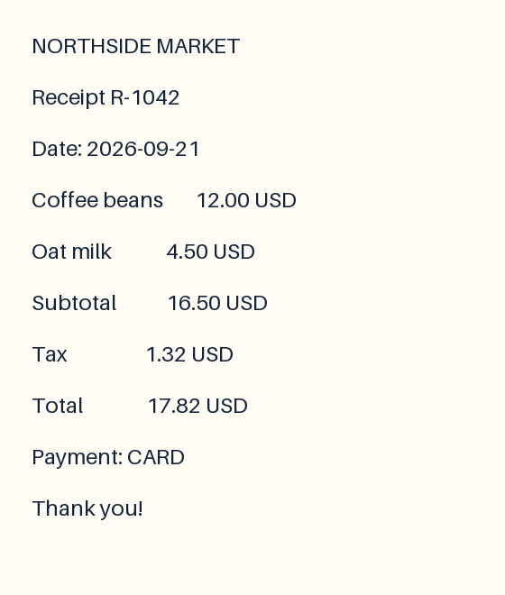

# OCR receipt: 2–6 keys in, structured fields out

Open [index.html](index.html) locally for an interactive reference preview. Select 2–6 keys and inspect values and evidence boxes together. The bundled receipt and OCR-style transcription are synthetic; no OCR engine was run. This preview uses annotations and reports `confidence: null`, never invented model scores.



## Prepare a request

From the repository root after installing the package:

```bash
python examples/ocr_receipt/extract.py \
  --keys merchant date total payment_method --prepare-only
```

The adapter builds candidates from every OCR line before looking at any labels. It parses values after colons or multiple spaces while retaining the full line as evidence. All fields share the same candidates, including a null candidate. Keys may be arbitrary nonempty strings; only 2–6 unique keys are accepted. The viewer offers six fixture keys, including an absent email address.

## Run your checkpoint

```bash
python examples/ocr_receipt/extract.py \
  --keys merchant date total payment_method \
  --checkpoint checkpoints/demo --device cpu --threshold 0.8 \
  > outputs/receipt-result.json
```

Create `outputs/` first if needed. Load the result JSON into the viewer using its file input. Inference never reads `annotations.jsonl`. No trained task checkpoint is bundled; a one-step smoke checkpoint is not expected to extract accurately.

The result maps each requested key to `value`, `confidence`, `confidence_kind`, `calibrated`, `abstained`, `candidate_id`, `evidence`, and the candidate `probabilities`. Confidence is the selected candidate's raw softmax probability, **not calibrated correctness**. A null selection or probability below the threshold yields a null value and abstention. Its confidence still describes the selected candidate, not the probability of a valid non-null answer.

Replace `ocr.json` with your OCR output in the same schema: local image path, pixel width/height, and spans with unique IDs, text, and pixel `xyxy` boxes. OCR recognition scores are not used as extraction confidence. The fixture parser is intentionally simple; production normalization and OCR quality need separate validation.

Fields are now processed in one document sequence with one image encoding and one backbone forward. Every field has its own readout position and shares the candidate head. This is parallel candidate extraction, not free-text MTP. Field order can affect predictions through causal context; no calibrated verification or measured end-to-end speedup is claimed. All fixture questions belong to the same source group and must stay in one data split.

Rebuild the bundled assets with `python examples/ocr_receipt/build.py`.
